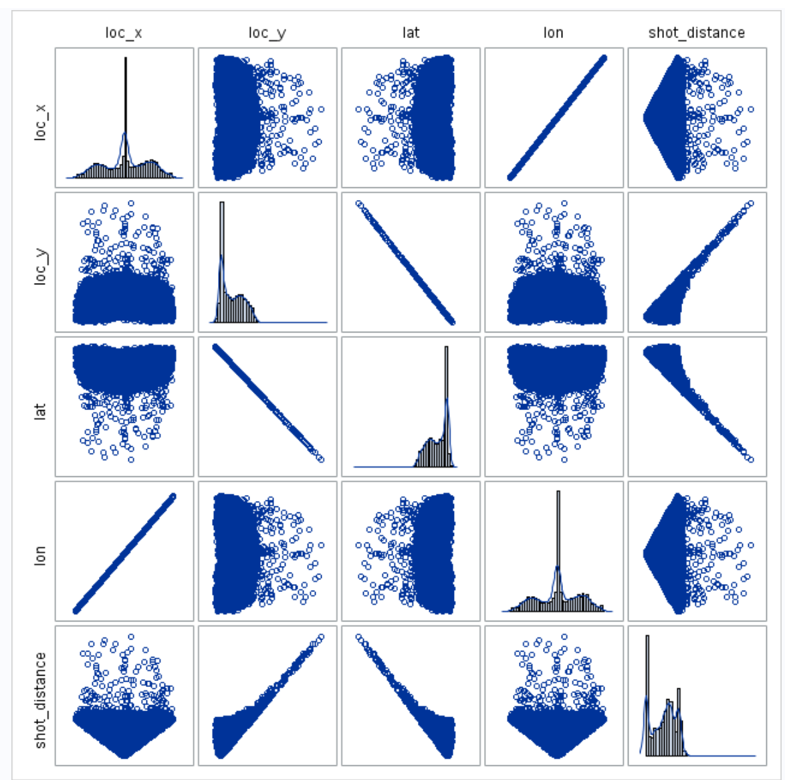

```{r setup, include=FALSE}
knitr::opts_chunk$set(echo = FALSE)
library(mosaic)
library(aod)
library(kableExtra)
library(vcd)
layout(matrix(c(1,2,3,4),2,2))
```


```{r}
# read data
kobe = read.csv("./project2Data.csv")

# set factors
kobe$action_type = factor(kobe$action_type)
kobe$shot_type = factor(kobe$shot_type)
kobe$combined_shot_type = factor(kobe$combined_shot_type)
kobe$shot_zone_area = factor(kobe$shot_zone_area)
kobe$shot_zone_basic = factor(kobe$shot_zone_basic)
kobe$shot_zone_range = factor(kobe$shot_zone_range)
kobe$season = factor(kobe$season)
kobe$playoffs = factor(kobe$playoffs)
kobe$period = factor(kobe$period)
kobe$season = factor(kobe$season)
kobe$playoffs = factor(kobe$playoffs)
kobe$shot_made_flag = factor(kobe$shot_made_flag)
kobe$time_remaining = 60*kobe$minutes_remaining+kobe$seconds_remaining
```

## Abstract

Sports data modeling has been a staple of video game development for many years.
The major leagues leagues NBA, NFL, NHL have all partnered with various software development
companies to produce ever more realistic video games depicting the leagues's top stars
acting and more importantly scoring as they do in real life.  With the $20 billion
video game industry fueled by the now growing e-sports segment, ever more realistic models
are needed for developers to build the characters in their games.  We explore
a common dataset of Kobe Bryant's depicting the shots he made and missed over his
20 year career and try to build a model that would predict with a high degree of probability
the likelihood of his making or missing a shot.  We show that our final model is moderately successful
in predicting a shot.  We speculate that additional data points commonly captured in sport statistics
such as whether or not the shot was contested could add specificity to the model.

## Introduction

Kobe Bryan is a retired professional basketball player who spent 20 years with the Los Angles Lakers.  Kobe entered the NBA directly out of Lower Menton High School in Pennsylvania.  He won 5 NBA Championships, was selected to the All-Star team 18 times, and won 2 Olympic gold medals.  He is also widely considered one of the greatest basketball players of all time. 

Using 20 years of data on Kobe's shots made and shots missed, we explore potential models that attempt to predict whether or not his shot went in.  The data set `project2Data.xlsx` contains the location on the floor some surrounding circumstances of every shot he attempted in the NBA. Free Throw data is not included in the dataset.  We attempt to build a model from this data that can predict with a reasonable degree of certainty whether the shot went in (shot_made_flag = 1) or missed (shot_made_flag = 0).  We tested our final model against the held out `project2Pred.xlsx` dataset which was not used in training or testing the iterative models.

This type of model could be used in building a simulation or video game mimicking Kobe's game. Sports data modeling has been a staple of video game development for many years. The major leagues leagues NBA, NFL, NHL have all partnered with various software development companies to produce ever more realistic video games depicting the leagues's top stars acting and more importantly scoring as they do in real life.  With the $20 billion video game industry fueled by the now growing e-sports segment, ever more realistic models are needed for developers to build the characters in their games.

## Data Description

The field names are self explanatory.  The predictors our analysis focused on are as follows:

| Data Label         | Description                                         |
|--------------------|-----------------------------------------------------|
| combined_shot_type | Type of shot combined with action                   |
| loc_y              | Vertical position on floor                          |
| minutes_remaining  | Minutes remaining in quarter                        |
| playoffs           | Playoff game or not                                 |
| seconds_remaining  | Seconds remaining in quarter                        |
| shot_distance      | Distance from goal                                  |
| shot_made_flag     | 1- shot went I, 0 - shot missed                     |
| shot_type          | 2pt or 3pt shot                                     |
| attendance         | The attendance in the stadium                       |
| arena_temp         | The average temperature during the game             |
| avgnoisedb         | The average noise level in dB during the game       |


## Data Analysis

We evaluated a large but not exhaustive number of predictive variable combinations and potential models in our analysis.  The following variables played a part in our final model


- Shot_distance : We analyzed the hyphothesis that Kobe's odds of making his shots decreased as the shot distance increased and whether or not this was a linear phenomenon.
- Shot_type : we saw a statistically signifigant contribution from shot_type in a number of our test models we led us to include this variable into our final model.
- Combined_shot_type : Likewise combined_shot_type showed a stitistically signifigant contribution in a number of models
- Playoffs : We included this predictor in a model used to evaluate Kobe's performance in the regular season vs. the playoffs


```{r}
par(mfrow=c(2,2))

plot(kobe$shot_made_flag,col=rainbow(2),xlab="Missed(0) Made(1)")
plot(kobe$playoffs,col=rainbow(2),xlab="Shots in Regular Season(0) and Playoffs(1)")

plot(kobe$shot_type,col=rainbow(2), xlab="Shot Type")
plot(kobe$combined_shot_type,col=rainbow(5), xlab="Combined Shot Type") 
```


We combined the following continuous variables into their principle components to include in out final model.

- Time_remaining : We created this datapoint from minutes_remaining*60+seconds_remaining
- Average Attendance 
- Average Temperature 
- Average Noise Level (dB)


## Multicollinearity Analysis

High bivariate correlations were easy to spot bwhen we ran correlation calculations among our target predictors.  We noticed signifigant correlations between loc_y and shot_distance, loc_x and lon and loc_y and lat. Coincidently we did not find models with both `loc_y` and `shot_distance` or with `loc_x` and `lon` or `loc_y` and `lat` to be good models due to their colinearity.

```{r}
predictors = kobe %>% dplyr::select(loc_x,loc_y,lat,lon)
cor(predictors)

predictors = kobe %>% dplyr::select(loc_y,shot_distance)
cor(predictors)
```



There are also some similarities betweeb categorical variables although categorical variables cannot be colinear. They do not represent linear measures in Euclidean space.  We use chi-square tests to determine independence of categorical variables.

However it is helpful to visualize some of the similaities.  The graph below shows high colinearity between layups and dunks, and a high degree of similarity with bankshots and tipshots.  All of which are understandable.  However all of these shot types are also in the same categorical variable, and as such not directly colinear with any otehr variables. 

```{r}
tbl = kobe %>% select(shot_type, combined_shot_type)
assoc(tbl,shade=TRUE,legend = TRUE)
```


## Outlier Analysis


## Analysis Questions

We set out to test the following hyphothesis:

1. The odds of Kobe making a shot decrease with respect to the distance he is from the hoop.
2. The probability of Kobe making a shot decreases linearly with respect to the distance he is from the hoop.    
3. The relationship between the distance Kobe is from the basket and the odds of him making the shot is different if they are in the playoffs.

To test these hyphothesis we evaluated several models.  For the first we evelated a logisic regression model consisting of shot_distance, shot_type, combined_shot_type and a linear combination of the continuous variables time_remaining, attendance, arena_temp, avgnoisedb using principal componenet analysis. Principal component analysis is a statistical techinique that transforms a set of possibly correlated variables into a set of values of linearly uncorrelated variables.

Our PCA analysis revealed that the first orthoganol combination contributed nealy 95% of the variance of these variables where as the remaining transformations did not contribute signifigantly.

```
proc princomp cov prefix=k data=kobe out=kobe;
var time_remaining attendance arena_temp avgnoisedb;
run;
```

```{r}
pcamodel = kobe %>% select(time_remaining,attendance,arena_temp,avgnoisedb)
pca <- prcomp(pcamodel) 
plot(pca, type = "l")
print(pca)
```

In final SAS model was then we only included k1, the first orthagonal combination of PCA analysis.

```
  class shot_type home combined_shot_type(ref='Jump Shot') /param=ref;
  model shot_made_flag(event='1') = shot_distance shot_type k1 combined_shot_type
```

```{r}
log1 = glm(shot_made_flag ~ shot_distance + combined_shot_type + shot_type , data=kobe,family="binomial")
```

From the results in the table above, shot_distance, combined_shot_type, shot_type, and k1 all appear to be statistically signifigant with p-values << 0.

```{r}
t = wald.test(b = coef(log1), Sigma = vcov(log1), Terms = 2:6)
```

Furthermore the chi-squared test statistic of 914.9, with 5 degree of freedom and a p-value << 0 indicates that the overall effect of combined_shot_type is statistically significant as well.


