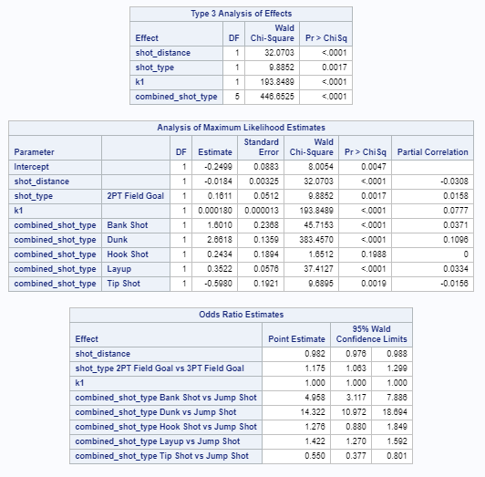

```{r setup, include=FALSE}
knitr::opts_chunk$set(echo = FALSE)
library(mosaic)
library(aod)
library(kableExtra)
library(vcd)
layout(matrix(c(1,2,3,4),2,2))
```


```{r}
# read data
kobe = read.csv("./project2Data.csv")

# set factors
kobe$action_type = factor(kobe$action_type)
kobe$shot_type = factor(kobe$shot_type)
kobe$combined_shot_type = factor(kobe$combined_shot_type)
kobe$shot_zone_area = factor(kobe$shot_zone_area)
kobe$shot_zone_basic = factor(kobe$shot_zone_basic)
kobe$shot_zone_range = factor(kobe$shot_zone_range)
kobe$season = factor(kobe$season)
kobe$playoffs = factor(kobe$playoffs)
kobe$period = factor(kobe$period)
kobe$season = factor(kobe$season)
kobe$playoffs = factor(kobe$playoffs)
kobe$shot_made_flag = factor(kobe$shot_made_flag)
kobe$time_remaining = 60*kobe$minutes_remaining+kobe$seconds_remaining
```

## Abstract

Sports data modeling has been a staple of video game development for many years. The major leagues leagues NBA, NFL, NHL have all partnered with software development companies to produce realistic video games depicting the leagues's top stars acting and scoring as they do in real life.  

With the $20 billion video game industry fueled by the now growing e-sports segment, ever more realistic models are needed for developers to build the characters in their games and to stay competitive in the market.  We explore a common dataset of Kobe Bryant's career shots, and try to build a model that would predict
the likelihood of his making or missing a shot. 

We show that our final model is moderately successful, 65%, as in predicting a shot.  We further speculate that additional data points commonly captured in sport statistics such as whether or not the shot was contested could add specificity to the model.


## Data Description

The field names are self explanatory.  The predictors our analysis focused on are as follows:

| Data Label         | Description                                         |
|--------------------|-----------------------------------------------------|
| combined_shot_type | Type of shot combined with action                   |
| loc_y              | Vertical position on floor                          |
| minutes_remaining  | Minutes remaining in quarter                        |
| playoffs           | Playoff game or not                                 |
| seconds_remaining  | Seconds remaining in quarter                        |
| shot_distance      | Distance from goal                                  |
| shot_made_flag     | 1- shot went I, 0 - shot missed                     |
| shot_type          | 2pt or 3pt shot                                     |
| attendance         | The attendance in the stadium                       |
| arena_temp         | The average temperature during the game             |
| avgnoisedb         | The average noise level in dB during the game       |


## Data Analysis

We evaluated a large but not exhaustive number of predictive variable combinations and potential models in our analysis.  The following variables played a part in our final model


- Shot_distance : We analyzed the hyphothesis that Kobe's odds of making his shots decreased as the shot distance increased and whether or not this was a linear phenomenon.
- Shot_type : We saw a statistically signifigant contribution from shot_type which led us to include this variable into our final model.
- Combined_shot_type : Likewise combined_shot_type showed a statistically signifigant contribution.
- Playoffs : Used to evaluate Kobe's performance in the regular season vs. the playoffs


```{r}
par(mfrow=c(2,2))

plot(kobe$shot_made_flag,col=rainbow(2),xlab="Missed(0) Made(1)")
plot(kobe$playoffs,col=rainbow(2),xlab="Shots in Regular Season(0) and Playoffs(1)")

plot(kobe$shot_type,col=rainbow(2), xlab="Shot Type")
plot(kobe$combined_shot_type,col=rainbow(5), xlab="Combined Shot Type") 
```


We combined the following continuous variables into their principle components to include in out final model.

- Time_remaining : We created this datapoint from minutes_remaining*60+seconds_remaining
- Average Attendance 
- Average Temperature 
- Average Noise Level (dB)


## Multicollinearity Analysis

High bivariate correlations were easy to spot bwhen we ran correlation calculations among our target predictors.  We noticed signifigant correlations between loc_y and shot_distance, loc_x and lon and loc_y and lat. Coincidently we did not find models with both `loc_y` and `shot_distance` or with `loc_x` and `lon` or `loc_y` and `lat` to be good models due to their colinearity.

```{r}
predictors = kobe %>% dplyr::select(loc_x,loc_y,lat,lon)
cor(predictors)

predictors = kobe %>% dplyr::select(loc_y,shot_distance)
cor(predictors)
```

There are also some potential similarities between the categorical variables in the dataset although categorical variables cannot be colinear as they do not represent linear measures in Euclidean space.  As such we use chi-square tests on our coeficientsto determine independence and signifigance of the categorical variables.


## Outlier Analysis

Based on Cooks's D data and plain data analysis, we are seeing no outlier present in the selected variables. Here is the first 5 observations with highest cook's D value.  Since these values are less than 3, we assume that there are no outliers. 


## Analysis Questions

We set out to test the following hyphothesis:

1. The odds of Kobe making a shot decreases with the distance from the hoop.
2. The probability of Kobe making a shot decreases linearly with distance.    
3. The relationship between the distance Kobe is from the basket and the odds of him making the shot is different if they are in the playoffs.

To test these hyphothesis we evaluated several models.  For the first we evaluated a logisic regression model consisting of `shot_distance, shot_type, combined_shot_type` and a linear combination of the continuous variables time_remaining, attendance, arena_temp, and avgnoisedb` using principal componenet analysis. Our PCA analysis revealed that the first orthoganol combination contributed nealy 95% of the variance of these variables and the remaining transformations did not contribute signifigantly.


```{r}
pcamodel = kobe %>% select(time_remaining,attendance,arena_temp,avgnoisedb)
pca <- prcomp(pcamodel) 
plot(pca, type = "l")
```

In final SAS model then we only included k1, the first orthagonal combination of PCA analysis.

```
model shot_made_flag(event='1') = shot_distance shot_type k1 combined_shot_type
```

Regression analysis revealed that shot_distance, combined_shot_type, shot_type, and k1 all appear to be statistically signifigant with p-values << 0.



Furthermore the wald ChiSquare test statistics (5 df, p-value << 0) for combined_shot_type and  (chi^2 =8.23 , p-value << .0041) for shot_type indicates that the overall effect of the categorical variables are independant and also statistically significant.


The ROC curve revealed an AUC of .63, which is less than ideal, but better than random guessing.  .7 Is the usual target for this statistic.  The logistic model shows that or a 1 unit increase in shot_distance, the odds of Kobe making his shot decreases by about 2% (+/- .06% ).


